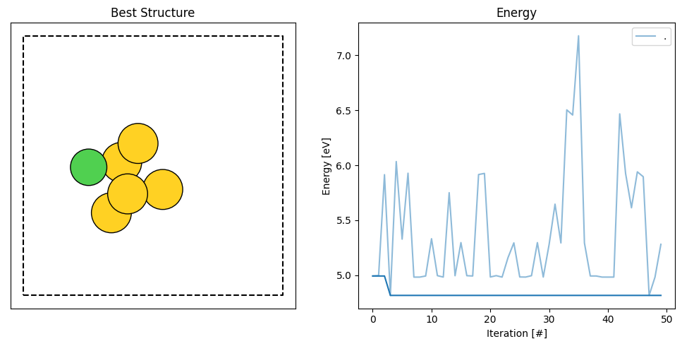

Getting started: First AGOX run
================================

Having installed AGOX we are ready to try performing an actual AGOX search. 

An example of a script is given below.

.. literalinclude:: rss_script_single.py

This script runs a random-structure-search run for a easy system consisting of just 5 gold atoms and a single nickel atom 
described by the EMT potential included in ASE. 

Copy the script and save it as rss_script_single.py in a seperate folder, such as example_single (Name is not important, but this is the filename we have used).

.. code-block:: console

   python rss_script_single.py

This will run in about a minute on a modern machine. After completion the script has produced a single file 'db1.db'.
This file contains the information gathered by the search run. We can analyze the run using the a tool installed together 
with AGOX. 

Assuming that $AGOX_DIR points towards your AGOX installation (otherwise just replace that with the full-path), in the same 
folder that you did the run, use the command
.. code-block:: console

   python $AGOX_DIR/utils/batch_analysis.py -d . -e -hg -c

This produces a figure like this one: 

Which shows the structure with the lowest energy found on the left and the energy as a function of the iteration number on the right.
Here the deeper blue is the best energy found until and including that iteration and the lighter blue is the energy of the actual structure 
found at that iteration. 