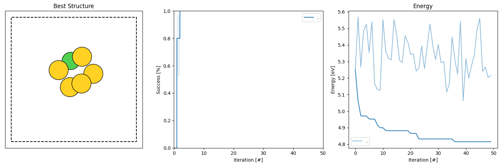
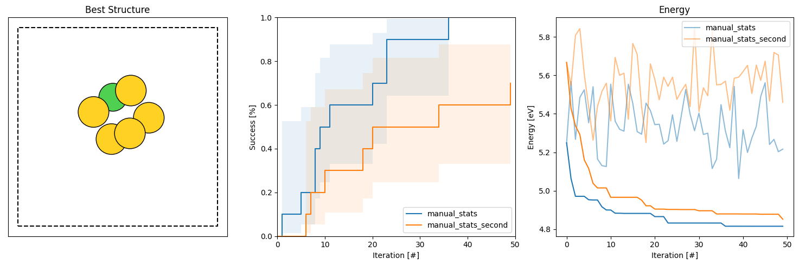

Getting started: Multiple runs
================================

Normally we are not interested in just the output of a single run, we want to run multiple independent runs of the same script.
This gives us more results and the ability to gauge how well the algorithm has performed on the problem which informs how 
confident we should be in the solutions that it finds. 

The simplest way of running multiple restarts is a for-loop, the script below is a slightly altered version of the one from 
the previous section. 

.. literalinclude:: rss_script_serial.py

We can run this script in exactly the same way, preferably in an empty directory

.. code-block:: console

   python rss_script_serial.py

It will now take a while longer and after it finishes 10 '.db' files have been produced. 

We may analyze these by running 

.. code-block:: console

   python $AGOX_DIR/utils/batch_analysis.py -d . -e -hg -dE 0.005

Which now produces a figure like this one: 

Where we now also show the success curve with the criteria specified by the '-dE' argument. 

If we repeat the search again in another folder, such that we have two folders each containing 10 different '.db' files we 
may also compare them:

.. code-block:: console

   python $AGOX_DIR/utils/batch_analysis.py -d small_gold_serial_1 small_gold_serial_2 -e -hg -dE 0.005

Which now has two sets of curves for both the success and the energy. Given that we have not changed anything about the search 
algorithm or settings between the two sets of runs. The differences between them stem from the stochastic nature of the 
algorithm! 

.. note:: 

   The search runs can be made completely reproducible by using the 'seed' argument in the initialization of the 
   AGOX object. 

   ``agox = AGOX(environment=environment, db=database, collector=collector, gauges=gauges, seed=1)``

   If we want to make a set of runs reproducible we can set the seed to the iteration variable

   ``agox = AGOX(environment=environment, db=database, collector=collector, gauges=gauges, seed=run_idx)``

