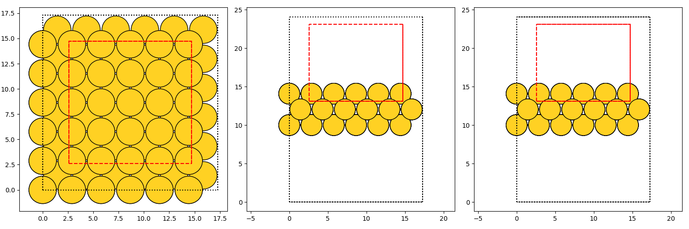

Pt14-Au (EMT): Runscript
==========================

In this example we want to employ AGOX to find the global minimum structure of 14 platinum atoms on a 
gold surface. 

Full runscript
_______________

The runscript for this looks like this: 

.. literalinclude:: Pt14_kappa2.py 
    :language: python

So about 120 lines of code to setup the search. 

Walkthrough 
___________

The first many lines are just import statements that are not too interesting. The first lines that are interesting 
are 

.. literalinclude:: Pt14_kappa2.py 
    :language: python
    :lines: 38-39

Here the template gold surface is defined and the environment module of AGOX is setup using this 
template with the specification that the search places 14 Pt atoms. 

Next the GPR model and lower-confidence-bound acquisitor are defined 

.. literalinclude:: Pt14_kappa2.py 
    :language: python
    :lines: 57-62

The acquisitor is given both the model and a list of guages, which here only contains an EnergyGauge that 
uses the EMT calculator from ASE. The acquisitor uses the given model to decide on which candidate to 
evaluate with the given guages. 

Before the generators are defined a confinement cell is defined 

.. literalinclude:: Pt14_kappa2.py 
    :language: python
    :lines: 68-72

This is used by generators to confine the volume in which the atoms will be placed, in this case 
the atoms are confined to the center area of the cell in the XY-plane and can only be placed 
on the upper-side of the gold template. 

Next the generators are defined

.. literalinclude:: Pt14_kappa2.py 
    :language: python
    :lines: 74-79

Here three types of generators are initiated and gathered in a list that will later be given to the 
collector module alongside the num_samples dictionary that controls how many candidates are generated 
using each of the generators. 

To apply model relaxation a postprocessor is defined:

.. literalinclude:: Pt14_kappa2.py 
    :language: python
    :lines: 81-87

The BoxConstraint ensures the relaxation obeys the same confinement as the generators. Next the relaxer 
is defined, note that it does not use the bare GPR model but rather it obtains a calculator from the acquisitor. 
This makes it so that relaxation happens in the lower-confidence-bound landscape rather than the pure GPR model energy 
landscape. 

Finally the main AGOX object is initialized using the defined modules and the search is started and will run for 1000 episodes.  

.. literalinclude:: Pt14_kappa2.py 
    :language: python
    :lines: 97-100

The script produces a number of files, some of which are plots of the confinement limits such as this one 
generated for the StartGenerator

When setting up new systems it is worthwhile to look at these plots to make sure the confinement is as 
expected! 

